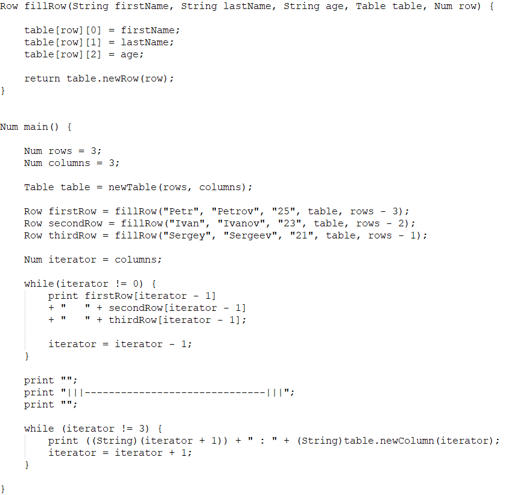
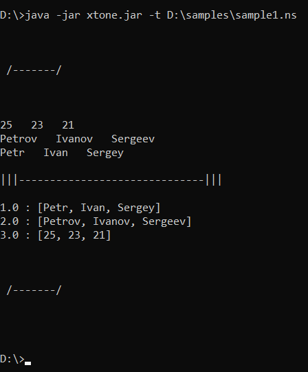
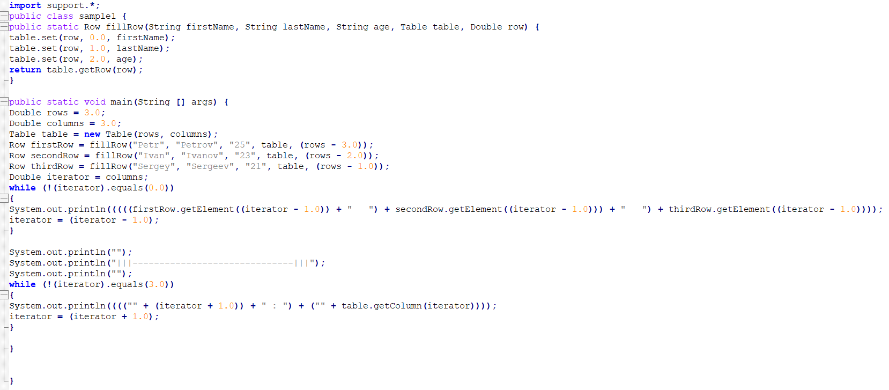

# Xtone

## What is it?
Xtone is a simple interpreter which is also able to translate source language to java code as a target language.
It has standard functionality to work with integer numbers and strings but also has 3 additional types: Table,
Column and Row. These are types with immutable size to store data in tables and retrieve certain rows or column from the tables.
There are for and while loops, if-else statements for condition checks and print key-word to transfer results to the 
standard output stream.

## How it works?

Xtone interpreter accepts 2 arguments. First parameter "-t" is optional and used to translate source file having ".ns" extension
as a java file.
The other one is a path to the file to process. It may produce ".java" file depending on whether you passed first argument
to it. The produced file can also be executed by JVM.

### Example
This interpreter works as a regular java application so to start it you have to pass jar-file path to JVM
with one or two arguments described above. Here is an example of working case.

Current version can translate only to java code but this feature is extendable. 